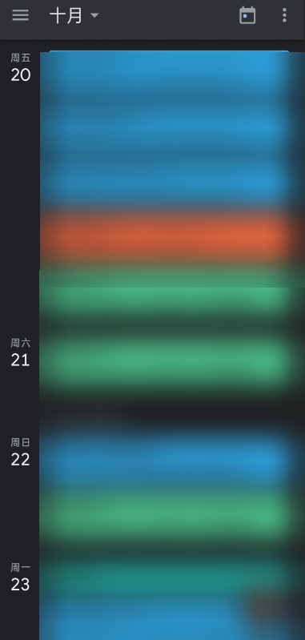

# LZU-calendar
 适用于兰州大学的课表采集工具，将教务系统的数据导出为日历ics文件

## 为什么做？

由于 ~~我不到啊~~的原因，兰朵儿在校园网下无法正常使用，所以做了这个，技术力很低，大佬们看个乐子就好（（

## 如何运行？

使用pip安装 `beautifulsoup4`,`requests`,`pytz`,`ics`这几个库

打开`main.py`并填入你在教务系统登陆后得到的cookie

运行`main.py`

程序会帮你生成`calendar.ics`文件，你可以把它导入到任何一个日历软件中。

联动谷歌日历后的效果如图

